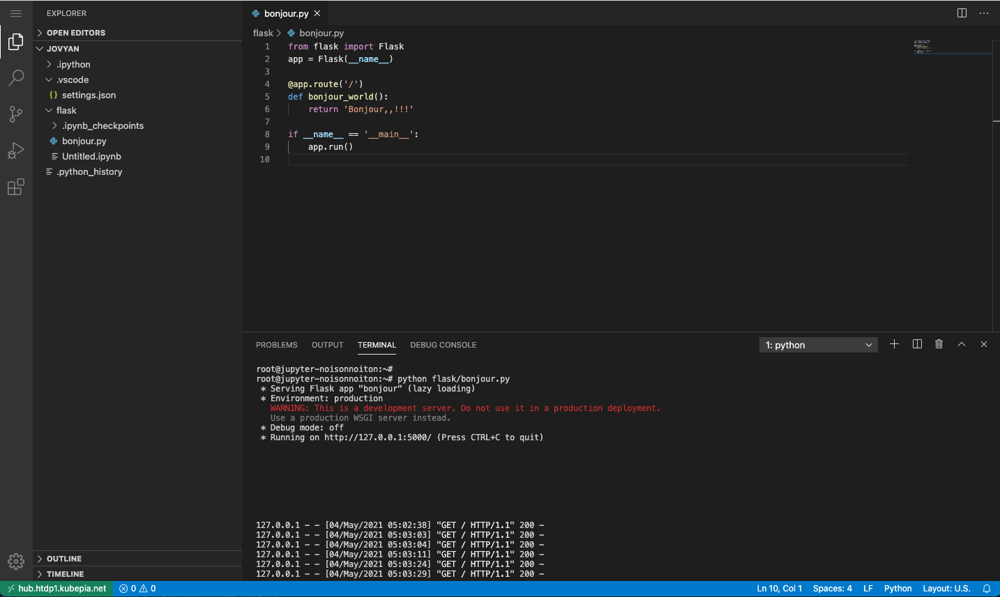
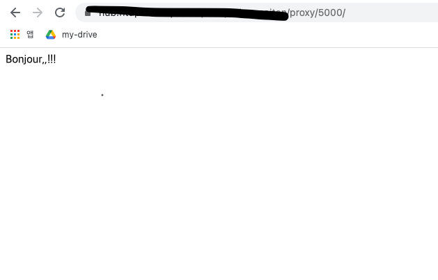
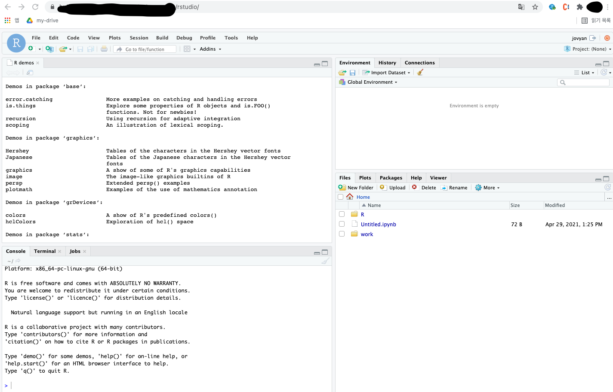

## Introduction

Jupyter Server Proxy를 사용하여, Notebook 과 함께 임의의 외부 프로세스 (ex> RStudio, VS Code etc.) 를 실행하고, 이에 대한 인증을 Notebook Server 가 대신 처리하여 Access 를 제어할 수 있다.  

Notebook / Lab 환경에 jupyter-server-proxy extension 을 설치를 통하여 proxy 활성화 가능하며, 각 extension 에서 proxy url 과 mapping 된 버튼을 선택하여 browser 를 통해 access 할 수 있다.

- Jupyter Notebook Extension 에서 실행
</img>
- Jupyter Hub Extension 에서 실행
</img>

> Jupyter Server Proxy Docs 참조
<https://jupyter-server-proxy.readthedocs.io/en/latest/index.html>

> Running nonjupyter applications on JupyterHub with jupyter-server-proxy| JupyterCon 2020
<https://www.youtube.com/watch?v=8tFLZWT0u2Y>


## Setup with Jupyter Hub

JupyterHub를 사용하고 있고 해당 서버에서 port 8080 를 listening 하는 process 가 있다고 가정 할 때, Jupyter Hub URL 을 사용하여 port 8080 에서 실행되는 서비스에 access 가능. (ex> myhub.org/hub/{user-redirect}/proxy/8080)

Hub 에 login 되어 있는 특정 사용자에게 올바른 URL로 redirection 이 제공되고, default_url 설정을 통해서 proxy context URL 에 default access 도 가능. Hub 에 login 되지 않은 사용자가 로그인하지 않은 경우, login 인증 완료 한 후 redirection.

- Architecture

@startuml
skinparam component {
}
"Client" as client
node "EKS" as eks {
  rectangle "Jupyter Hub" as jhub {
    (AuthClass) as hubauth
  }
  rectangle "Jupyter Notebook" as notebook {
    (Jupyter Server Proxy) as proxy
    (WebApp:p8080) as webapp
  }
}
top to bottom direction
client -> jhub: /hub/proxy/8080
hubauth -down-> proxy: Redirect to {user-redirect}
proxy <.down.> webapp #line:blue;line.dashed;text:blue : req / res
@enduml


## Customization

Code Server, R Studio 등 web application 으로 제공되는 서비스를, Jupyter Notebook 과 함께 구동하여 proxy 로 service 할 때 필요한 항목 확인.  


### Code Server by Jupyter Proxy

- 작업 내역
  - jupyter notebook 기반 Code Server Base Image 생성
  - vscode 설정 생성 및 COPY
  - jupyter_notebook_config.py config 생성 및 COPY
  - Jupyter Hub Profile 에, jupyter-code-server profile 및 kubespawner 설정

> htdp1 Github Repository
<https://github.com/htdp1/jupyter-k8s/tree/main/dev/jupyter-notebook/code-server>

#### Create Base Image

- Dockerfile 구성
  - Jupyter minimal-notebook Official Image 기반 작업
  - Conda 환경에서 jupyter-server-proxy package 설치
  - serverextension 및 labextension 활성화
  - Linux Code Server 설치
  - vscode, jupyter configuration directory 복사

```Dockerfile
# Jupyter Official Image 활용
ARG BASE_CONTAINER=jupyter/minimal-notebook
FROM $BASE_CONTAINER

USER $NB_UID

# Jupyter Server Proxy 설치 및 extension 활성화
RUN "${CONDA_DIR}/bin/pip" install jupyter-server-proxy \ 
  && jupyter serverextension enable --sys-prefix jupyter_server_proxy \
  && jupyter labextension install --no-build @jupyterlab/server-proxy

USER root

# Linux Code Server 설치
ENV CODESERVER_URL="https://github.com/cdr/code-server/releases/download/v3.4.0/code-server-3.4.0-linux-amd64.tar.gz" \
    CODESERVER="code-server-3.4.0-linux-amd64"

RUN wget ${CODESERVER_URL} && \
    tar -xvzf ${CODESERVER}.tar.gz && \
    cp -r ${CODESERVER} /usr/lib/code-server && \
    ln -s /usr/lib/code-server/bin/code-server /usr/bin/code-server && \
    rm -rf code-server* && \
    rm -rf /tmp/* && \
    rm -rf $HOME/.cache && \
    rm -rf $HOME/.node-gyp && \
    fix-permissions $CONDA_DIR && \
    fix-permissions $HOME

WORKDIR	$HOME

USER	$NB_UID

# 미리 생성해 놓은 configuration directory 복사
COPY	.jupyter /home/$NB_USER/.jupyter
COPY 	.vscode /home/$NB_USER/.vscode

USER	root
RUN	fix-permissions "/home/${NB_USER}/.vscode"

USER	$NB_UID
```

#### jupyter server proxy config

- jupyter_notebook_config.py 생성
  - Jupyter Server Proxy 를 통하여, 특정 URL 에 대한 proxy 실행 command, launch_entry 등을 정의.  
  - Jupyter Hub 의 입장에서는 기본적으로 Jupyter Notebook 을 실행하는 개념이므로, NotebookApp Config 를 정의하고, proxy serverextension 설정은 ServerProxy Config 를 통해서 정의.

```python
import  os
import shutil

# Linux Code Server 실행 script 정의
def _get_code_server_cmd(port):
    executable = "code-server"
    if not shutil.which(executable):
        raise FileNotFoundError("Can not find code-server in PATH")

    # Start vscode in CODE_WORKINGDIR env variable if set
    # If not, start in 'current directory', which is $REPO_DIR in mybinder
    # but /home/jovyan (or equivalent) in JupyterHubs
    working_dir = os.getenv("CODE_WORKINGDIR", ".")

    extensions_dir = os.getenv("CODE_EXTENSIONSDIR", None)
    extra_extensions_dir = os.getenv("CODE_EXTRA_EXTENSIONSDIR", None)

    cmd = [
        executable,
        "--auth",
        "none",
        "--disable-telemetry",
        "--port=" + str(port),
    ]

    if extensions_dir:
        cmd += ["--extensions-dir", extensions_dir]

    if extra_extensions_dir:
        cmd += ["--extra-extensions-dir", extra_extensions_dir]

    cmd.append(working_dir)
    return cmd

# Jupyter Notebook Config
c.NotebookApp.allow_root = True
c.NotebookApp.ip = '0.0.0.0'
c.NotebookApp.default_url = '/code-server/'

# Server Proxy Config
c.ServerProxy.servers = {
  # /code-server url 로 접근 시, server proxy 에서 아래 command 실행
  'code-server': {
    'command': _get_code_server_cmd,
    'timeout': 20,
    'launcher_entry': {
      'title': 'VS Code IDE',
      'icon_path': os.path.join(
                os.path.dirname(os.path.abspath(__file__)), "icons", "code-server.svg"),
    }
  }
}
```

#### Jupyter Hub Config 설정

Jupyter Hub config.yaml 에 profile 추가 및 kubespawner 설정

- config.yaml 구성 내역
```yaml
...

    - display_name: "Jupyter Code Server"
      description: "jupyter server proxy vscode"
      kubespawner_override:
        cpu_limit: 1
        cpu_guarantee: 0.5
        mem_limit: 2G
        mem_guarantee: 512M
        args: 
          - "--allow-root"
        # jupyter notebook 기반 Code Server Base Image
        image: htdp1/jupyter-code-server:latest
        image_pull_secrets: docker-hub-noisonnoiton
        default_url: /code-server/
        volume_mounts:
          - name: jupyter-code-server
            mountPath: /home/jovyan
        volumes:
          - name: jupyter-code-server
            persistentVolumeClaim:
              claimName: jupyter-code-server

...
```

#### Jupyter Code Server 에서 Web App. 개발

위와 같이 생성된 Jupyter Code Server 에서 Web App. 개발 시, proxy 를 통하여 특정 Port 의 Web Service 를 URL 을 통하여 브라우저에서 호출할 수 있다.

- flask python code example
```python
from flask import Flask
app = Flask(__name__)

@app.route('/')
def bonjour_world():
    return 'Bonjour,,!!!'

if __name__ == '__main__':
    app.run()
```

- Jupyter Code Server 에서 실행
```sh
$ python flask/bonjour.py 
 * Serving Flask app "bonjour" (lazy loading)
 * Environment: production
   WARNING: This is a development server. Do not use it in a production deployment.
   Use a production WSGI server instead.
 * Debug mode: off
 * Running on http://127.0.0.1:5000/ (Press CTRL+C to quit)
```


- 5000 번 port 를 URL 에 명시하여, Web Browser 에서 Jupyter Server Proxy 를 통하여 호출
: ex> myhub.org/hub/{user-redirect}/proxy/5000


### R Studio by Jupyter Proxy

R Studio 의 경우, Jupyter 에서 오픈소스로 제공하는 jupyter-rsession-proxy package 가 존재하여, 별도의 notebook config 설정 작업이 필요 없음.

- 작업 내역
  - jupyter notebook 기반 R Studio Base Image 생성
  - Base Image 에 jupyter-rsession-proxy package 설치
  - Jupyter Hub Profile 에, jupyter-code-server profile 및 kubespawner 설정

> htdp1 Github Repository
<https://github.com/htdp1/jupyter-k8s/tree/main/dev/jupyter-notebook/rstudio>


#### Create Base Image

- Dockerfile 구성
  - Jupyter minimal-notebook Official Image 기반 작업
  - Conda 환경에서 <u>jupyter-rsession-proxy</u> package 설치
  - R Studio 설치

```Dockerfile
ARG BASE_CONTAINER=jupyter/minimal-notebook
FROM $BASE_CONTAINER


USER root

RUN "${CONDA_DIR}/bin/pip" install jupyter-rsession-proxy && \
    jupyter labextension install --no-build @jupyterlab/server-proxy

ENV RSTUDIO_URL="https://download2.rstudio.org/server/trusty/amd64/rstudio-server-1.2.5019-amd64.deb"
ENV RSTUDIO="rstudio-server-1.2.5019-amd64.deb"

RUN echo "deb http://security.ubuntu.com/ubuntu xenial-security main" >> /etc/apt/sources.list

# install rstudio-server
RUN apt-get update && \
    apt-get -y install libssl1.0.0 libssl-dev && \
    cd /lib/x86_64-linux-gnu && ln -s libssl.so.1.0.0 libssl.so.10 &&  ln -s libcrypto.so.1.0.0 libcrypto.so.10  && \
    cd /tmp/ && wget ${RSTUDIO_URL} --no-check-certificate && \
    apt-get install -y /tmp/${RSTUDIO} && \
    rm /tmp/${RSTUDIO} && \
    apt-get clean && rm -rf /var/lib/apt/lists/*

ENV PATH=$PATH:/usr/lib/rstudio-server/bin

```


#### jupyter-rsesssion-proxy

- jupyter-rsession-proxy package 확인 내역
  - package 에 R Studio 실행에 필요한 rstudio-server, rsession 실행 script 가 정의되어 있음.
  - /rstudio url 로 접근 시 처리되는, ServerProxy Config 가 미리 정의되어 있어, 별도의 notebook config 설정이 필요 없음.


- package setup.py
```python
import setuptools

setuptools.setup(
    name="jupyter-rsession-proxy",
    version='1.2',
    url="https://github.com/jupyterhub/jupyter-rsession-proxy",
    author="Ryan Lovett & Yuvi Panda",
    description="Jupyter extension to proxy RStudio",
    packages=setuptools.find_packages(),
	keywords=['Jupyter'],
	classifiers=['Framework :: Jupyter'],
    install_requires=[
        'jupyter-server-proxy'
    ],
    # package 실행 entrypoint
    entry_points={
        'jupyter_serverproxy_servers': [
            # /rstudio 처리 및 command mapping
            'rstudio = jupyter_rsession_proxy:setup_rserver'
        ]
    },
    package_data={
        'jupyter_rsession_proxy': ['icons/rstudio.svg'],
    },
)
```

> jupyter-rsession-proxy Github Repository 참조
<https://github.com/jupyterhub/jupyter-rsession-proxy>


#### Jupyter Hub Config 설정

Jupyter Hub config.yaml 에 profile 추가 및 kubespawner 설정

- config.yaml 구성 내역

```yaml
...

    - display_name: "Jupyter R Studio"
      description: "jupyter server proxy rsession"
      kubespawner_override:
        cpu_limit: 1
        cpu_guarantee: 0.5
        mem_limit: 2G
        mem_guarantee: 512M
        args: 
          - "--allow-root"
        image: htdp1/jupyter-rstudio:latest
        image_pull_secrets: docker-hub-noisonnoiton
        default_url: /rstudio/
        # jupyter notebook 기반 Code Server Base Image
        volume_mounts:
          - name: jupyter-rstudio
            mountPath: /home/jovyan
        volumes:
          - name: jupyter-rstudio
            persistentVolumeClaim:
              claimName: jupyter-rstudio

...
```

- 접속 화면


