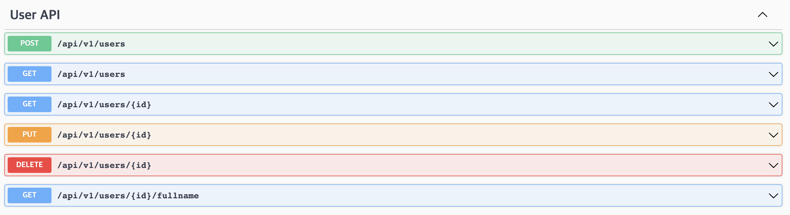
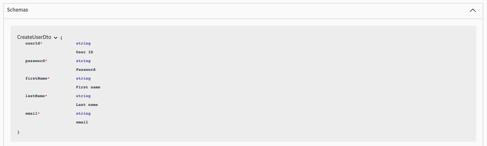

Node.js v16.15.x 이상의 stable version 기준, Backend Framework 검토.

## NestJS (Nest)

- OOP / FP 등의 요소가 결합되어, 기존 Spring 기반 Backend 개발 방식과 유사하게 작업이 가능
- Typescript 를 지원하여 pure Javascript 에서 다루기 어려운, Data Type 등을 관리하는데 강점
- CLI 가 제공되어, 개발 resource 를 자동으로 생성하는 기능을 제공
- 관련 문서
  - Nest 공식 개발 문서: <https://docs.nestjs.com/>
  - Nest CRUD Generator 설명: <https://docs.nestjs.com/recipes/crud-generator>

### Repository

- Nest 초기 검토 내역: <https://github.com/hcp-bpcp/hcp-bpcp-backend-nestjs>
- Nest 기반 기능 검증: <https://github.com/hcp-bpcp/hcp-bpcp-backend-nestjs>
  - ORM: TypeORM, Prisma
  - ODM: Mongoose
  - Redis 기반 Cache, Queue 활용

### CLI 활용

Nest CLI 활용은 최초에 framework setup 시 유리한 점이 많으며, 이미 제공된 framework 내에서 API 추가할 경우에는 _<u>굳이 사용하지 않아도 관계 없음.</u>_

::: tip
  Nest CLI Docs.
  <https://docs.nestjs.com/cli/usages#cli-command-reference>
:::

- Nest CLI Install

Node.js Global package 로 설치

```sh
npm i -g @nestjs/cli
```

- nest generate
  - `nest generate resource` 를 활용하여, REST API 및 CRUD Endpoint 자동 생성 가능
  - module, controller, service, dto, entity 관련 파일이 자동 생성되며, AppModule 에 auto-import
  - CLI 를 활용하여 자동 생성한 typescript resource tree 구조 예시
  ```
  ├── dto
  │   ├── create-user.dto.ts
  │   └── update-user.dto.ts
  ├── entities
  │   ├── user.entity.ts
  │   └── user.provider.ts
  ├── users.controller.ts
  ├── users.module.ts
  └── users.service.ts
  ```

  - Nest CLI command `nest generate` 를 활용하여 생성 가능한 element 는 아래 예시 참조

  ```
  Generate a Nest element.
    Schematics available on @nestjs/schematics collection:
      ┌───────────────┬─────────────┬──────────────────────────────────────────────┐
      │ name          │ alias       │ description                                  │
      │ application   │ application │ Generate a new application workspace         │
      │ class         │ cl          │ Generate a new class                         │
      │ configuration │ config      │ Generate a CLI configuration file            │
      │ controller    │ co          │ Generate a controller declaration            │
      │ decorator     │ d           │ Generate a custom decorator                  │
      │ filter        │ f           │ Generate a filter declaration                │
      │ gateway       │ ga          │ Generate a gateway declaration               │
      │ guard         │ gu          │ Generate a guard declaration                 │
      │ interceptor   │ in          │ Generate an interceptor declaration          │
      │ interface     │ interface   │ Generate an interface                        │
      │ middleware    │ mi          │ Generate a middleware declaration            │
      │ module        │ mo          │ Generate a module declaration                │
      │ pipe          │ pi          │ Generate a pipe declaration                  │
      │ provider      │ pr          │ Generate a provider declaration              │
      │ resolver      │ r           │ Generate a GraphQL resolver declaration      │
      │ service       │ s           │ Generate a service declaration               │
      │ library       │ lib         │ Generate a new library within a monorepo     │
      │ sub-app       │ app         │ Generate a new application within a monorepo │
      │ resource      │ res         │ Generate a new CRUD resource                 │
      └───────────────┴─────────────┴──────────────────────────────────────────────┘
  ```

### CRUD Resource

Nest 기반 API 개발 시 활용되는 resource 자세한 내용은 아래 문서 참고.

- Documents Reference
  - Basics
  <https://docs.nestjs.com/first-steps>
  - Controllers
  <https://docs.nestjs.com/controllers>
  - Providers
  <https://docs.nestjs.com/providers>
  - Modules
  <https://docs.nestjs.com/modules>

### Configurtaion 분리

Nest 는 `@nestjs/config` package 를 제공하여, configuration 관리를 framework 차원에서 쉽게 가능하도록 함.  
기본적으로 Node.js 에서 흔히 사용하는 **dotenv** 를 내장하고 있는 module 이며, `process.env` 를 활용하여 .env 에 정의된 config key 에 접근 가능.

::: tip
  Nest Configuration 관련 문서
  <https://docs.nestjs.com/techniques/configuration>
:::

- Nest Config module 적용
  - 일반적으로 Node.js application 구동 시 활용하는 `NODE_ENV` 환경 변수 정의를 통하여, production / development 배포 환경을 구분하는 방식 사용
  - Container build 시, 환경 변수 정의하도록 통일.
  
  ```Dockerfile
  ### env config
  ENV NODE_ENV=dev
  ```

  - config file 관리
  ```
  config
  ├── .dev.env
  └── .local.env
  ```

  - ConfigModule import (`app.module.ts`)

  ```typescript
  ...
  import { ConfigModule } from '@nestjs/config';
  
  ...

  @Module({
    imports: [
      ConfigModule.forRoot({
        envFilePath:
          'config/' +
          (process.env.NODE_ENV === 'prd'
            ? '.prd.env'
            : process.env.NODE_ENV === 'stg'
            ? '.stg.env'
            : process.env.NODE_ENV === 'dev'
            ? '.dev.env'
            : '.local.env'),
      }),
  ...
  ```

### Logger 설정

Nest 에서는 `@nestjs/common` 에 내장된 기본 logger module 을 통해서, logging 에 대한 편의성을 제공하고 있음.  
Framework 관점에서는, 추가적으로 Access Logging 을 위한 공통 middleware 를 개발하여 적용하였음.

::: tip
  Nest Logging 관련 문서
  <https://docs.nestjs.com/techniques/logger>
:::

- 공통 module import 내역
  - LoggerModule, WinstonMiddleware import (`app.module.ts`)
  ```typescript
  ...
  import { LoggerModule, WinstonMiddleware } from 'hcp-bpcp-module-common';

  ```
  - Access Logging 을 윈한 middleware 적용 (`app.module.ts`)
  ```typescript
  export class AppModule {
    configure(consumer: MiddlewareConsumer) {
      consumer.apply(WinstonMiddleware).forRoutes('*');
    }
  }
  ```
  - 공통 module repository: <https://github.com/hcp-bpcp/hcp-bpcp-module-common>

- Logger 공통 module
  - Winston 기반으로 log formatting 을 표준화 하였으며, 공통 module 의 LoggerService 를 import 하여 code 내에서 활용 가능
  - logger 활용 예시
  ```typescript
  ...
  // 공통 module 에서 import
  import { LoggerService } from 'hcp-bpcp-module-common';
  ...
  // Class 내에 정의 및 활용
    private readonly logger = new LoggerService(TodosService);
  ...
    this.logger.debug('Debugging');
  ...
  ```

### Swagger 설정

Node.js 기반 Backend 개발 시 API 문서 관리를 위한 swagger 설정의 경우, 각 API 에 대한 Spec 을 comment 등으로 직접 정의해야 하는 어려움이 있으나, Nest 의 경우 swagger 관련 module 이 포함되어 있는 `@nestjs/swagger` package 를 제공하여 API 문서 관리에 대한 편의성을 제공.

::: tip
  Nest Swagger 관련 문서
  <https://docs.nestjs.com/openapi/introduction>
:::

- Swagger setup 공통 service
  - `/api-docs` URL 로 접근 가능한, Swagger document spec 정의를 위한 class 정의
  - `utils/swagger.service.ts`
  ```typescript
  import { INestApplication } from '@nestjs/common';
  import { SwaggerModule, DocumentBuilder } from '@nestjs/swagger';

  export class SwaggerService {
    // eslint-disable-next-line @typescript-eslint/no-empty-function
    constructor() {}
    /**
    * Swagger settings.
    *
    * @param {INestApplication} app
    */
    public setupSwagger(app: INestApplication) {
      const options = new DocumentBuilder()
        .setTitle('NestJS API Docs')
        .setDescription('NestJS API description')
        .setVersion('1.0.0')
        .build();

      const document = SwaggerModule.createDocument(app, options);
      SwaggerModule.setup('api-docs', app, document);
    }
  }
  ```

- Swagger API Docs setup
  - Nest AppModule 을 포함한 application 구동 시 실행되는 `main.ts` 에서, swagger 공통 service 의 function 호출
  - `main.ts` setupSwagger function 호출
  ```typescript
  ...
  import { SwaggerService } from './utils/swagger.service';
  ...
  // Swagger setup
  new SwaggerService().setupSwagger(app);
  ```

- (Optional) Swagger 공통 module 활용
  - swagger setup 을 위한 function 을 공통 module 설치를 통해서도 활용 가능하나, API 문서 Spec 변경의 자유도가 떨어짐
  - 활용 방법
    - `npm install hcp-bpcp-module-common` 로 package 설치
    - `import { SwaggerService } from 'hcp-bpcp-module-common';` 로 import
  - 공통 module repository: <https://github.com/hcp-bpcp/hcp-bpcp-module-common>

- API Tag 정의 방법
  - Contoller 단위로 Swagger API Tagging 가능
  - Controller 내에, `@ApiTags` Decorator 적용 예시
  ```typescript
  ...
  import { ApiTags } from '@nestjs/swagger';
  ...
  @ApiTags('User API')
  @Controller('users')
  export class UsersController {
  ...
  ```
  - Swagger 화면 조회 예시
  

- API Schema 정의
  - DTO 혹은 API Docs 에 포함되기 원하는 class 에 API Property 를 적용하여 schema 정의 가능
  - `@ApiProperty` Decorator 적용 예시
  ```ts
  import { ApiProperty } from '@nestjs/swagger';

  export class CreateUserDto {
    @ApiProperty({ description: 'User ID' })
    readonly userId: string;
    @ApiProperty({ description: 'Password' })
    readonly password: string;
    @ApiProperty({ description: 'First name' })
    readonly firstName: string;
    @ApiProperty({ description: 'Last name' })
    readonly lastName: string;
    @ApiProperty({ description: 'email' })
    readonly email: string;
  }
  ```
  - Swagger 화면 조회 예시
  


## Express

pure Javascript 기반 Node.js Express backend framework 검토.  
Nest 활용으로 최종 결정하였으나, 간단한 Test 용 API sample 개발 내역임.

### Repository

- Express 기반 기능 검증: <https://github.com/hcp-bpcp/hcp-bpcp-backend-express>
  - ORM: sequelize
  - Entity 자동 생성 및 CRUD 기능 개발
  - Raw SQL 활용 검토

### Example

- routes / controllers / models 기준의 layered arch. 적용
- Directory 구조 아래 참고
```
app
├── app.js
├── config
│   └── db.config.js
├── controllers
│   └── user.controller.js
├── models
│   ├── index.js
│   └── user.model.js
├── routes
│   ├── index.js
│   └── user.routes.js
├── server.js
└── utils
    ├── swagger
    │   └── User.yaml
    └── swagger.js
```
