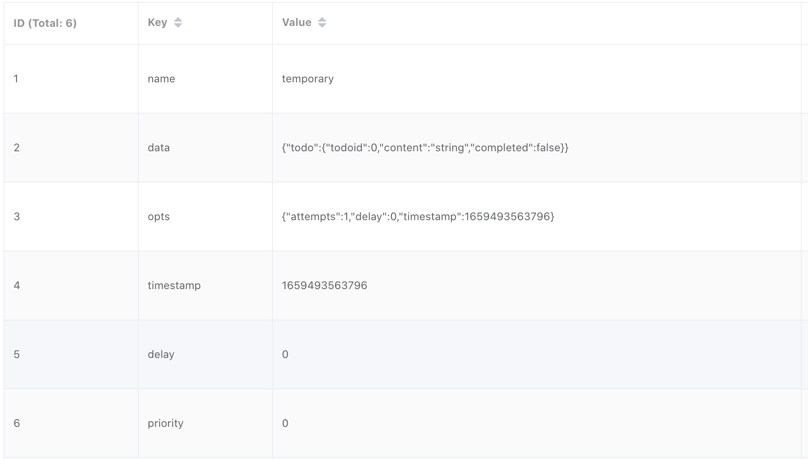
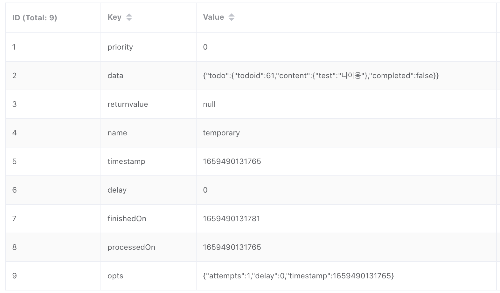
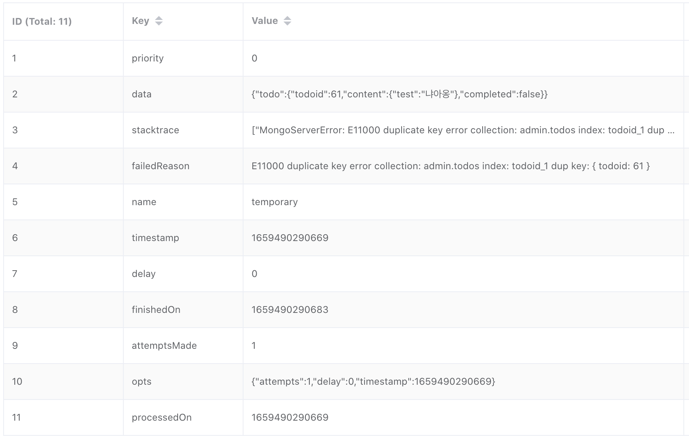
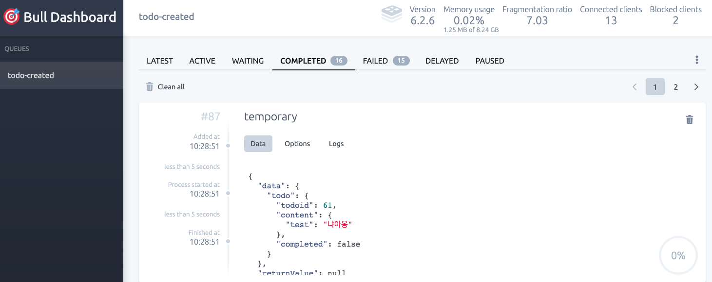

Redis 기반 Caching, Queue 관리 기능 검증
- Caching: cache-manager, @nestjs/common CacheModule
- Queue: bull, @nestjs/bull BullModule

## Caching (cache-manager)

Nest 에서 제공하는 caching 관련 통합 API 활용 방법.  
기본적으로 cache-manager 에서 제공하는 `Cache` class 의 내장 함수를 활용하여 cache 조회/등록/삭제 등을 수행한다.

- Installation required packages
```sh
$ npm install cache-manager
$ npm install -D @types/cache-manager
```

::: tip
  Nest Caching
  <https://docs.nestjs.com/techniques/caching>
:::

### Source code repository

- Github Repository
  - REST API 기반 caching test: <https://github.com/hcp-bpcp/hcp-bpcp-backend-v1>
  - Auth token caching : <https://github.com/hcp-bpcp/hcp-bpcp-backend-auth>
  - Websocket 활용시 caching: <https://github.com/hcp-bpcp/hcp-bpcp-backend-webpush>

### Nest CacheModule 정의

Nest 는 `@nestjs/common` 의 `CacheModule` 을 기반으로 cache storage provider 를 제공.

- Redis cache module 관리 directory 구조
```sh
src/database/redis
├── redis.cache.module.ts
```

- redis.cache.module.ts
  - `@nestjs/common` 에서 제공하는 `CacheModule` 을 활용하며, Cache store 정의 및 `RedisCacheModule` 로 export
  - Store 정의 없을 경우, 기본적으로 in-memory caching
  - Store 를 redis 로 정의하기 위하여, `cache-manager-ioredis` 를 활용
  - Provider 는 별도로 존재하지 않으며, 각 module 에서 `RedisCacheModule` 을 import 하여 사용
```ts
import { CacheModule as NestCacheModule, Module } from '@nestjs/common';
import * as redisStore from 'cache-manager-ioredis';

@Module({
  imports: [
    NestCacheModule.registerAsync({
      isGlobal: true,
      useFactory: () => ({
        store: redisStore,
        host: process.env.REDIS_HOST,
        port: process.env.REDIS_PORT,
        ttl: 60,
        password: process.env.REDIS_PASSWORD,
      }),
    }),
  ],
  providers: [],
  exports: [],
})
export class RedisCacheModule {}
```

### Cache Test API

Interceptor 활용이나, key 별 cache 관리 등의 다양한 기능이 있으나, get / set 활용의 간단한 REST API 로 test 하였음.

- Test API directory 구조
```sh
src/api/v1/cache
├── cache.controller.ts
├── cache.module.ts
└── cache.service.ts
```

- cache.module.ts
  - database 에 정의한 `RedisCacheModule` import
```ts
import { Module } from '@nestjs/common';
import { RedisCacheModule } from '../../../database/redis/redis.cache.module';
import { CacheController } from './cache.controller';
import { CacheService } from './cache.service';

@Module({
  imports: [RedisCacheModule],
  controllers: [CacheController],
  providers: [CacheService],
})
export class CacheModule {}
```

- cache.service.ts
  - Nest 에서 기본적으로 제공하는 `CACHE_MANAGER` token 주입 기반으로, cache-manager 의 `Cache` class 를 정의 
  - 'time' key 존재 여부에 따른 cache get / set 관리 test
```ts
import { Injectable, Inject, CACHE_MANAGER } from '@nestjs/common';
import { Cache } from 'cache-manager';

@Injectable()
export class CacheService {
  constructor(@Inject(CACHE_MANAGER) private cacheManager: Cache) {}

  async cache(): Promise<string> {
    const savedTime = await this.cacheManager.get<number>('time');
    if (savedTime) {
      return 'saved time : ' + savedTime;
    }
    const now = new Date().getTime();
    await this.cacheManager.set<number>('time', now);
    return 'save new time : ' + now;
  }
}
```

- cache.controller.ts
  - REST API endpoint
```ts
import { Controller, Get } from '@nestjs/common';
import { ApiTags } from '@nestjs/swagger';

import { CacheService } from './cache.service';

@ApiTags('Cache')
@Controller('cache')
export class CacheController {
  constructor(private readonly cacheService: CacheService) {}

  @Get()
  async getCache() {
    return this.cacheService.cache();
  }
}
```

- Test result
  - Cache 생성 및 만료 설정 실행 결과
  ```sh
  $ curl 'https://hcp-bpcp-backend-v1.bpcp.kubepia.net/api/v1/cache'
  
  save new time : 1659489894415
  ```

  - Cache data 조회
  ```sh
  $ curl 'https://hcp-bpcp-backend-v1.bpcp.kubepia.net/api/v1/cache'
  
  save time : 1659489894415
  ```

## Queues (bull)

Nest 에서 제공하는 bull 관련 wrapping module 기반 queue 활용 방법.  
Bull 은 기본적으로 Redis 를 활용하여 queue data 를 관리하며, produce/subscribe 관련 기능을 제공.

- Installation required packages
```sh
$ npm install @nestjs/bull bull
$ npm install -D @types/bull
```

::: tip
  Nest Queues
  <https://docs.nestjs.com/techniques/queues>
:::

### Bull queue data

Queue name 별로 redis key 기반으로 각각의 job data 를 생성하며, job 에 고유한 sequential number 를 부여함.

- Example Queue 정보
  - Queue name: `todo-created`
  - Queue process name: `temporary`
  - Queue status 관리 key
    - Wait 상태의 job list: `bull:todo-created:wait`
    - Completed 상태의 job list: `bull:todo-created:completed`
    - Failed 상태의 job list: `bull:todo-created:failed`
  - Job data (Wait): `bull:todo-created:{jobId}`
    - 대기열에서 wait 상태로 대기중인 data
    

  - Job data (Completed): `bull:todo-created:{jobId}`
    - 정상적으로 완료된 queue job 에 대한 data
    - 완료 내역 update
    
  - Job data (Failed): `bull:todo-created:{jobId}`
    - 실패한 queue job 에 대한 data
    - stacktrace, failedReason 등 update
    

### Source code repository

- Github Repository
  - REST API 기반 queue / subscribe test: <https://github.com/hcp-bpcp/hcp-bpcp-backend-v1>

### Nest BullModule 정의

Nest 는 `@nestjs/bull` package 의 `BullModule` 을 기반으로 wrapping class 를 제공하며, `bull` package 의 `Queue` class 를 주입하여 내장 함수를 활용.

- Redis queue module 관리 directory 구조
```sh
src/database/redis
├── redis.queue.module.ts
```

- redis.queue.module.ts
  - `@nestjs/bull` 에서 제공하는 `BullModule` 을 활용
  - Provider 는 별도로 존재하지 않으며, 각 module 에서 `BullModule` 을 import 하여 사용할 queue 를 정의
```ts
import { Module } from '@nestjs/common';
import { BullModule } from '@nestjs/bull';

@Module({
  imports: [
    BullModule.forRootAsync({
      useFactory: () => ({
        redis: {
          host: process.env.REDIS_HOST,
          port: Number(process.env.REDIS_PORT),
          password: process.env.REDIS_PASSWORD,
        },
      }),
    }),
  ],
})
export class RedisQueueModule {}
```

### Queue based subscribe test

Queue 에 data 를 생성하고, subscribe 를 통한 job 수행을 통하여 해당 data 를 MongoDB 에 적재하는 test.

- Test API, producer, consumer 정의 directory 구조
```sh
src/api/v1/todos
├── consumers
│   └── todos.consumer.ts ### Queue subscriber
...
├── todos.controller.ts ### API endpoint
...
├── todos.module.ts ### BullModule import 및 queue 정의
└── todos.service.ts ### Queue producer
```

- todos.module.ts
  - `BullModule` 을 import 하고 queue 를 등록
  - Producer 및 Consumer 를 providers 에 정의
```ts
...
import { todosProviders } from './schemas/todos.providers';
import { BullModule } from '@nestjs/bull';
import { TodosConsumer } from './consumers/todos.consumer';

@Module({
  imports: [
    MongodbModule,
    BullModule.registerQueue({
      name: 'todo-created',
    }),
  ],
  controllers: [TodosController],
  providers: [...todosProviders, TodosService, TodosConsumer],
})
export class TodosModule {}
```

- todos.service.ts
  - 정의된 queue 에 data 생성을 위한 code 작성
  - module 에서 정의한 queue name 을 주입하여 `Queue` class 를 정의
  - 'temporary' 라는 process name 으로 queue data 생성
```ts
import { InjectQueue } from '@nestjs/bull';
import { Injectable, Inject } from '@nestjs/common';
import { Queue } from 'bull';
...

@Injectable()
export class TodosService {
  constructor(
...
    // Queue inject
    @InjectQueue('todo-created')
    private todoQueue: Queue,
  ) {}
...
  // Queue producer function
  async create_temporary(createTodoDto: CreateTodoDto): Promise<Todo> {
    const res = await this.todoQueue.add('temporary', {
      todo: createTodoDto,
    });
    return res.data;
  }
...
```

- todos.consumer.ts
  - Module 에서 정의한 queue name 을 주입하여 `Queue` class 를 정의
  - Queue 에 생성된 process name 기준으로 subscribe 하기 위해, `@Processor`, `@Process` 등 Decorator 활용
  - Event 기반 Decorator 활용 가능: `@OnQueueFailed`, `@OnQueueCompleted`
```ts
import {
  Processor,
  Process,
  InjectQueue,
  OnQueueFailed,
  OnQueueCompleted,
} from '@nestjs/bull';
import { Job, Queue } from 'bull';
...

@Processor('todo-created')
export class TodosConsumer {

  constructor(
...
    // Queue inject
    @InjectQueue('todo-created')
    private todoQueue: Queue,
  ) {}
  // Queue process name 에 대한, subscribe 및 실행 code
  @Process('temporary')
  async handleTemporary(job: Job) {
    await this.todoModel.create(job.data.todo);
  }

  @OnQueueFailed()
  async onQueueFailed(job: Job, result: any) {
    const msg = `(Queue) on Error: job ${job.id} -> result: ` + result;
    this.logger.error(msg);
  }

  @OnQueueCompleted()
  async onQueueCompleted(job: Job, result: any) {
    this.logger.log(JSON.stringify(job.data));
    const msg = `(Queue) on Completed: job ${job.id} -> result: ` + result;
    this.logger.log(msg);
  }
```

- Test result
  - Producer 생성 log 및 consumer failed / completed event 에 대한 log 생성 내역
```sh
### produce and job completed
[Winston] Info	2022-08-03T01:28:51+00:00 "POST /api/v1/todos/temporary" 201 Created - {"service":"api"} +19s
[Winston] Info	2022-08-03T01:28:51+00:00 {"todo":{"todoid":61,"content":{"test":"냐아옹"},"completed":false}} - {} +15ms
[Winston] Info	2022-08-03T01:28:51+00:00 (Queue) on Completed: job 87 -> result: undefined - {} +0ms
### produce and job failed
[Winston] Info	2022-08-03T01:31:30+00:00 "POST /api/v1/todos/temporary" 201 Created - {"service":"api"} +3m
[Winston] Error	2022-08-03T01:31:30+00:00 (Queue) on Error: job 88 -> result: MongoServerError: E11000 duplicate key error collection: admin.todos index: todoid_1 dup key: { todoid: 61 } - {} +13ms
```

### bull-board 활용

Bull queue monitoring 을 위한 admin UI 를 별도로 실행 가능.  
`main.ts` 실행 시, Bull board 관련 설정이 실행되도록 구성 (swagger setup 과 유사)

- 주요 기능
  - Redis memory usage, fragmentation ratio 등 monitoring
  - Queue name 별 redis data 조회
  - Queue status 별 redis data 조회
  - Queue data 삭제
  - Failed job 에 대한 retry
  - Bull dash board 에 대한 인증 관리

- Installation required packages
  - `ExpressAdapter` 를 활용하여, express server 에 base path 설정
  - App. 이 실행되면서 정의된 `Queue` class 기반으로 `BullAdapter` 를 생성
```sh
$ npm install @bull-board/api @bull-board/express
```

- main.ts
```ts
import { createBullBoard } from '@bull-board/api';
import { BullAdapter } from '@bull-board/api/bullAdapter';
import { ExpressAdapter } from '@bull-board/express';
...

async function bootstrap() {
...

  // Bull dashboard setup
  const serverAdapter = new ExpressAdapter();
  serverAdapter.setBasePath('/admin/queues');
  const aQueue = app.get<Queue>(`BullQueue_todo-created`);
  createBullBoard({
    queues: [new BullAdapter(aQueue)],
    serverAdapter,
  });
  app.use(
    '/admin/queues',
    serverAdapter.getRouter(),
  );
...

}

bootstrap();
```

- Example dashboard

