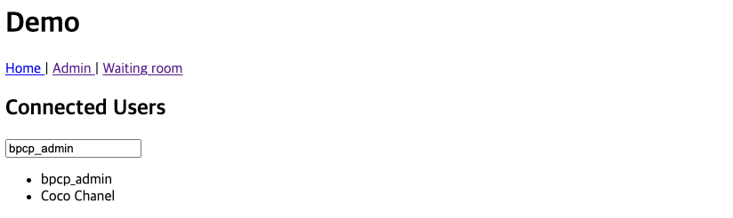
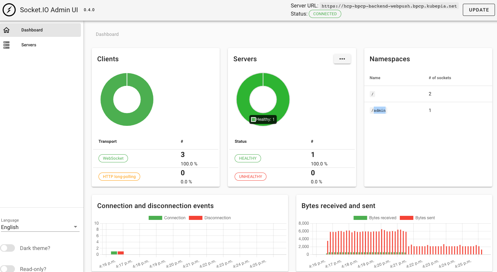

Socket.IO 기반 websocket 활용 방안 및 push 기능 관련 검증

## websocket (socket.io)

socket.io 기반 server to client push, subscribe.  

- Installation required packages
```sh
$ npm i --save @nestjs/websockets @nestjs/platform-socket.io
```

:::tip
  Socket.IO Docs.
  <https://socket.io/docs/v4/>
:::

### Source code repository

Websocket event 를 발생시키기 위하여 Angular 기반 sample frontend 와, event 수신 및 socketId 별 emit 처리를 위한 Nest 기반 backend 구현.

- Github Repository
  - Socket.IO backend: <https://github.com/hcp-bpcp/hcp-bpcp-backend-webpush>
  - Socket.IO frontend: <https://github.com/hcp-bpcp/hcp-bpcp-frontend-webpush>

:::tip
  아래 Reference 기반으로 구성.
  Backend 의 경우 socketId 기반 emit, user list caching 등의 기능을 추가하였음.
  <https://betterprogramming.pub/detect-active-users-in-angular-using-nestjs-and-socket-io-1efaf336b267>
:::

### Nest Gateway 구성

Nest 는 Gateway 라는 개념으로 websocket library 기반 adapter 를 생성.  
`@WebSocketGateway` Decorator 를 활용하여 gateway 를 구성하고, socket server 에 대한 event 송수신, socket 의 lifecycle hook 등을 활용하는 방식을 구현.

:::tip
  Nest Gateways
  <https://docs.nestjs.com/websockets/gateways>
:::

- event 기반 gateway 구성 directory 구조
```sh
src/events
├── events.gateway.ts
└── events.module.ts
```

- events.gateway.ts
  - `@@WebSocketGateway` Decorator 활용, 기본적으로 Nest application 의 listening port 기준으로 설정됨
  - `implements OnGatewayInit, OnGatewayConnection, OnGatewayDisconnect` 의 interface 를 활용하여, socket 의 lifecycle hook function 활용
  - 기타, socket.io admin UI 및 cors 설정 등을 포함
```ts
import {
  SubscribeMessage,
  WebSocketGateway,
  OnGatewayInit,
  WebSocketServer,
  OnGatewayConnection,
  OnGatewayDisconnect,
  ConnectedSocket,
  MessageBody,
} from '@nestjs/websockets';
import { Socket, Server } from 'socket.io';
...

@WebSocketGateway({
  cors: {
    origin: [
      'https://admin.socket.io',
      'https://hcp-bpcp-socketio-admin.bpcp.kubepia.net',
      'http://localhost:8080',
    ],
    credentials: true,
  },
})
export class EventsGateway
  implements OnGatewayInit, OnGatewayConnection, OnGatewayDisconnect
{
...

  @WebSocketServer() server: Server;
...

  afterInit(server: Server) {
    this.logger.log(`Init: ${server.path()}`);
    instrument(server, {
      auth: false,
    });
  }

  handleDisconnect(client: Socket) {
    this.logger.log(`Client disconnected: ${client.id}`);
  }

  handleConnection(client: Socket, ...args: any[]) {
    this.logger.log(`Client connected: ${client.id}, ${args}`);
  }
}
```

### Event subscribe & emit

Gateway 구성 후, 해당 socket 의 특정 event subscribe 및 client 에 event push 기능 구현

- events.gateway.ts
  - `@SubscribeMessage` Decorator 를 활용하여, 'patientJoin' 이라는 event subscriber function 생성
  - `@ConnectedSocket()` Decorator 를 활용하여, socket 과 연결된 client 정보 활용 가능
  - `@MessageBody()` Decorator 를 활용하여, event payload 활용 가능
  - Code workflow
    1. **'patientJoin'** 이라는 event 가 frontend 에서 등록이되면, 이를 subscribe
    2. redis 에 user 정보 및 접속 시간 등을 생성 혹은 update
    3. Admin user 의 socketId 에게만, active user list 를 emit
    4. 각각의 active user socketId 기준으로, 각가의 등록 알림을 emit
```ts
...

  @SubscribeMessage('patientJoin')
  async joinRoom(
    @ConnectedSocket() client: Socket,
    @MessageBody() userName: string,
  ) {
    this.userSessionCache.addOrUpdate(userName, client.id);

    const activeUsers = await this.userSessionCache.getAllActive();
    const adminUser = await this.userSessionCache.getAdminActive();
    // adminUser 의 socketId 를 찾아서 activeUsers 전체 list 를 push
    this.server.to(adminUser.socketId).emit(
      'patientList',
      activeUsers.map((x) => x.userName),
    );
    // activeUsers 의 각 socketId 를 확인하여, 등록이 완료되었음을 알리는 message 를 push
    activeUsers.filter((x) => {
      this.server.to(x.socketId).emit(x.userName + ':registered');
    });
  }
...
```

### Cache 기반 검증

Redis caching 을 활용하여, socket 연결된 user 의 정보와 socketId 등을 저장

- Client user list sample
  - Admin user 는 **bpcp_admin** 이라는 user 로 고정하여, 해당 user 에게만 전체 active user list emit
  - Active list 판단은, lastConnectedTime 을 기준으로 60초 이내인 경우로 정의
  - Client 에서 최초에 server 에 event 등록 시 client 의 socketId 정보를 받아서, user 별 socketId 를 저장하도록 관리
```json
...
    {
        "DATE_TIME_FORMAT": "YYYY-MM-DDTHH:mm:ss",
        "userName": "bpcp_admin",
        "lastConnectedTime": "2022-08-03T06:53:20",
        "socketId": "8dvBgASLXbMkv2i4AAAL"
    },
    {
        "DATE_TIME_FORMAT": "YYYY-MM-DDTHH:mm:ss",
        "userName": "Christian Dior",
        "lastConnectedTime": "2022-08-03T06:52:20",
        "socketId": "enOuMMdNJtna6WnZAAAH"
    },
    {
        "DATE_TIME_FORMAT": "YYYY-MM-DDTHH:mm:ss",
        "userName": "Coco Chanel",
        "lastConnectedTime": "2022-08-03T07:00:04",
        "socketId": "ndQXCVnn0ziFEoqCAAAN"
    },
...
```

- Frontend 조회 결과
  - Admin user 의 active user list 조회 결과
  - 계속 client 가 연결되어 있거나, lastConnectedTime 기준에 부합하는 user list 만 조회


- Backend 실행 log
  - client 와의 socket 연결 lifecycle hook 에 따른 logging 결과
```sh
### 최초 socket.io server initialized
[Winston] Info	2022-08-03T06:24:19+00:00 Init: /socket.io - {"service":"EventsGateway"} +0ms

### OnGatewayConnection, OnGatewayDisconnected lifecycle hook 에 의한 function 실행 결과
[Winston] Info	2022-08-03T06:32:51+00:00 Client connected: 8dvBgASLXbMkv2i4AAAL,  - {"service":"EventsGateway"} +552ms
[Winston] Info	2022-08-03T06:58:15+00:00 Client disconnected: enOuMMdNJtna6WnZAAAH - {"service":"EventsGateway"} +25m
[Winston] Info	2022-08-03T06:58:15+00:00 Client connected: ndQXCVnn0ziFEoqCAAAN,  - {"service":"EventsGateway"} +477ms
```

## Socket.IO Admin

Socket.IO 에서 제공하는 admin UI 활용.

::: tip
  Socket.IO Admin UI Docs.
  <https://socket.io/docs/v4/admin-ui/>
:::

- Installation required packages
```sh
$ npm i --save @socket.io/admin-ui
```

### Gateway Admin UI 구성

- events.gateway.ts
  - WebSocketGateway 의 initialize 후, `OnGatewayInit` lifecycle hook 에 의해 function 실행
  - `@socket.io/admin-ui` package 의 instrument function 실행하여, 해당 socket 을 admin UI 에서 조회 가능
  - CORS 허용 설정이 필요
  - 인증 기능 설정 가능

```ts
...
import { instrument } from '@socket.io/admin-ui';

@WebSocketGateway({
  cors: {
    origin: [
      'https://admin.socket.io',
      'https://hcp-bpcp-socketio-admin.bpcp.kubepia.net',
      'http://localhost:8080',
    ],
    credentials: true,
  },
})
export class EventsGateway
  implements OnGatewayInit, OnGatewayConnection, OnGatewayDisconnect
{
...

  afterInit(server: Server) {
    this.logger.log(`Init: ${server.path()}`);
    instrument(server, {
      auth: false,
    });
  }
...
}

```

### Public Admin UI

admin.socket.io 에서 socket.io server 의 정보를 입력하여 admin UI 를 사용 가능.  
<u>보안 issue 발생할 수 있음.</u>

:::danger
  Public Socket.IO Admin UI
  <https://admin.socket.io>
:::

### Self-Hosted

admin.socket.io 의 source code 를 활용하여, 원하는 방식으로 hosting.  
<u>Static assets 만으로 hosting 구성 가능.</u>

- hcp-bpcp socketio admin github repository
<https://github.com/hcp-bpcp/hcp-bpcp-socketio-admin>

:::tip
  Socket.IO Admin UI Github repository
  <https://github.com/socketio/socket.io-admin-ui/>
:::

- Self-hosted admin UI 조회 결과
  - `/admin` namespace 로 admin UI 에 대한 client socket 이 생성됨
  - Client 와 연결된 socket status monitoring
  - Socker server status monitoring

